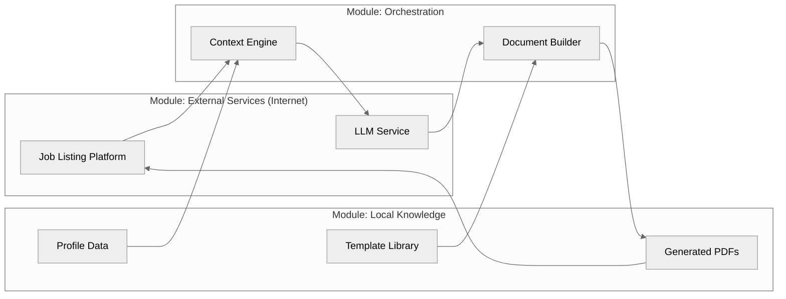

# Job Assistant

An automated tool to tailor resumes and cover letters for specific job posts, then autofill application forms. Uses DOCX/LaTeX templates, sensible defaults, and an LLM to generate customized application materials and streamline the application process.

<!-- Diagram source: docs/system_overview.mmd -->


### Features
- Token replacement in LaTeX/text templates via `util/strings.py` (`%%token%%`).
- Central defaults in `defaults.py`: `PERSON`, `EXPERIENCE`, `SKILLS`, `LETTER_CONTENT`.
- Assistant + LLM: fetch URL → extract text → build candidate data → generate application JSON.
- Document generation: DOCX templates for resumes with automatic conversion to PDF.
- PDF generation: compiles LaTeX templates to PDFs in `target/autogen/` with company name.
- Browser autofill: automatically fill job application forms with generated documents (Brave/Chrome supported).
- Profile persistence: use dedicated browser profiles to save login sessions and autofill data.
- ATS validation: iterative improvement loop using validation feedback.
- Responses API client (`ml.openai.OpenAI`) by default; Chat Completions (`ml.openai_compatible.OpenAICompatible`) still available.
- Usage logging: token counts logged automatically (no tracking classes).

### Install
- Python 3.11+
- Optional: LaTeX (TeX Live/MiKTeX) for PDF generation via LaTeX templates
- Python dependencies: `python-docx`, `playwright` (for browser automation), and LLM client packages
- Browser setup: `playwright install` (for Chromium/Brave automation)
- Optional override: pass `OpenAIConfig(default_model="...", timeout=...)` when constructing `OpenAI`.

### Setup
1) Adjust `settings.py` for default model, timeout, and max output tokens.
2) Edit `defaults.py` to add your details, experience, skills, and letter sections.
3) Templates:
   - DOCX template: `resume/resume_template.docx` (edit in Word/LibreOffice to customize format)
   - LaTeX templates in `resume/` and `letter/` use tokens like `%%FIRST_NAME%%`, `%%COMPANY%%`
   - Template files: `*_template.tex`, `resume_template.docx` (tracked in git)
   - Generated files: `body.tex`, `info.tex`, `workexperience.tex` (gitignored)
4) Optional: Configure browser path and profile directory in `application_pipeline.py:38-39` for autofill

### Quickstart

#### CLI Usage
Generate resume and cover letter from a job URL:
```bash
python main.py https://example.com/job-post
```

Generate only resume:
```bash
python main.py https://example.com/job-post -i resume
```

Generate, validate, and autofill form:
```bash
python main.py https://example.com/job-post -i all -f
```

Generate with validation, then improve using feedback:
```bash
# First run: generate resume and run ATS validation
python main.py https://example.com/job-post -i resume,validation

# Second run: regenerate resume incorporating validation feedback
python main.py https://example.com/job-post -r
```

Ask a question about your fit for a job posting:
```bash
python main.py https://example.com/job-post -q "How well do my skills match this role?"
```

#### Python API
```python
from application_pipeline import customise_application, autofill_with_outputs
from ml.gpt import GPT
from pathlib import Path

# Generate application materials
url = "https://example.com/job-post"
llm = GPT()
result = customise_application(
    job_listing="<job listing text>",
    llm=llm,
    out_dir=Path("target/autogen"),
    include_list=["resume", "letter"]
)

# Autofill application form (opens browser)
fill_result, browser = autofill_with_outputs(
    url=url,
    llm=llm,
    job_text="<job listing text>",
    application_data=result["application_data"],
    resume_pdf=result.get("resume_pdf"),
    letter_pdf=result.get("letter_pdf"),
    headless=False
)
# Browser stays open for manual review/submission
browser.page.wait_for_event("close")
```

### CLI Options
```bash
python main.py <url> [options]

Options:
  -i, --include <components>  Comma-separated list: letter, resume, validation, all (default: all)
  -v, --use-validation       Include previous validation feedback in resume generation prompt
  -r, --retry                Shorthand for -i resume -v (regenerate resume with validation feedback)
  -f, --fill                 Open browser and autofill form fields after generating documents
  -q, --question <text>      Ask a question about your fit for the job posting
  -a, --ask                  Answer mode (use with -q)
  -o, --output <dir>         Output directory (default: target/autogen)
```

Examples:
- Generate everything: `python main.py <url>`
- Resume only: `python main.py <url> -i resume`
- Resume with validation: `python main.py <url> -i resume,validation`
- With autofill: `python main.py <url> -i all -f`
- Iterative improvement: `python main.py <url> -i resume,validation` then `python main.py <url> -r`

### Python API Reference
Core functions from `application_pipeline.py`:

- `customise_application(job_listing, llm, out_dir, include_list=["resume"], validation_file=None) -> dict`
  Generate tailored application materials (DOCX resume, PDF, cover letter) from job listing text.

- `open_browser_for(url, headless=True, wait_until="domcontentloaded", timeout_ms=60000, executable_path="...", user_data_dir=Path) -> Browser`
  Open a browser instance with custom profile for form autofill. Defaults to Brave browser.

- `autofill_form(browser, llm, values={}, uploads={}, job_text="", application_data=None, ...) -> AutofillResult`
  Fill form fields in an already-open browser without submitting.

- `autofill_with_outputs(url, llm, job_text, application_data, resume_pdf=None, letter_pdf=None, headless=False, ...) -> tuple[AutofillResult, Browser]`
  Open page and autofill using generated artifacts. Browser stays open for review.

- `ask_about(question, about_url, llm) -> str`
  Ask a question about a job posting URL.

### Output schema (returned JSON string)
```json
{
  "details": { "company": "...", "role": "...", "recipient": "...", "city": "...", "state": "..." },
  "letter": { "Introduction": "...", "Why do I want to join this company?": "...", "Why should this company pick me?": "...", "Closing": "..." },
  "work_experience": [ { "company": "...", "role": "...", "start": "...", "end": "...", "location": "...", "bullets": ["..."] } ],
  "skills": ["..."]
}
```

### Browser Autofill
The autofill feature automatically fills job application forms using your generated documents:

1. **Profile persistence**: Uses a dedicated browser profile (`~/Library/Application Support/BraveSoftware/Brave-Browser-Autofill`) to save login sessions between runs.

2. **Smart field matching**: Matches form fields by name, ID, label, and placeholder text to automatically fill:
   - Personal info (name, email, phone)
   - Contact links (LinkedIn, GitHub, website)
   - Location, skills, languages
   - File uploads (resume, cover letter)

3. **LLM fallback**: For fields that can't be auto-matched, the LLM intelligently fills remaining fields based on job context.

4. **Snapshot & review**: Saves HTML snapshot to `target/autofill/` and keeps browser open for manual review before submission.

Configuration in `application_pipeline.py`:
- `executable_path`: Path to Brave/Chrome executable
- `user_data_dir`: Browser profile directory for session persistence

### ATS Validation Workflow
Iteratively improve your resume using validation feedback:

```bash
# First iteration: generate resume and run validation
python main.py <url> -i resume,validation

# Review validation output in target/validate/<sanitized_url>.json
# Second iteration: regenerate with feedback (shorthand for -i resume -v)
python main.py <url> -r
```

The validator provides:
- ATS compatibility score (0-10)
- Specific feedback on improvements
- Actionable suggestions

Validation results are saved with your application data for the next iteration.

### Notes
- Keep secrets out of the repo (use `.env` file for API keys).
- Generated documents: DOCX resumes at `target/autogen/{name}_{company}_resume.docx`
- Old documents automatically archived to `target/autogen/old/` with timestamp.
- LaTeX templates still supported (altacv class for resume).
- Token usage logged via `logging.info()` for each LLM request.
- Logging: `target/logs/app.log` and stdout via `setup_logging()`.
