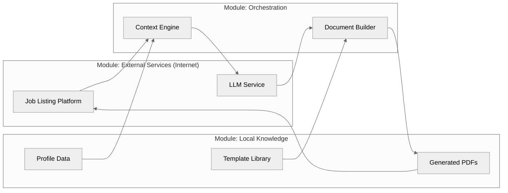

# Job Assistant

A small helper to tailor resumes and cover letters for specific job posts using templates, sensible defaults, and an LLM.

<!-- Diagram source: docs/system_overview.mmd -->


### Features
- Token replacement in LaTeX/text templates via `util/strings.py` (`%%token%%`).
- Central defaults in `defaults.py`: `PERSON`, `EXPERIENCE`, `SKILLS`, `LETTER_CONTENT`.
- Assistant + LLM: fetch URL → extract text → build candidate data → generate application JSON.
- PDF generation: compiles LaTeX templates to PDFs in `target/autogen/` with company name.
- Responses API client (`ml.openai.OpenAI`) by default; Chat Completions (`ml.openai_compatible.OpenAICompatible`) still available.
- Usage logging: token counts logged automatically (no tracking classes).

### Install
- Python 3.11+
- Optional: LaTeX (TeX Live/MiKTeX) for PDFs
- Install deps as needed for your LLM client (see `ml/`).
- Optional override: pass `OpenAIConfig(default_model="...", timeout=...)` when constructing `OpenAI`.

### Setup
1) Adjust `settings.py` for default model, timeout, and max output tokens.
2) Edit `defaults.py` to add your details and letter sections.
3) Templates in `resume/` and `letter/` use tokens like `%%FIRST_NAME%%`, `%%COMPANY%%`.
   - Template files: `*_template.tex` (tracked in git)
   - Generated files: `body.tex`, `info.tex`, `workexperience.tex` (gitignored)

### Quickstart
```python
from assistant import Assistant
from ml.openai import OpenAI

url = "https://example.com/job-post"
assistant = Assistant(OpenAI())  # Responses API default
assistant.generate_and_save_application(url)  # Generates PDFs in target/autogen/
```

Pretty-print and save next to an HTML file you saved:
```python
import json
from pathlib import Path as P
p = P("target/openings/job.html")
data = json.loads("result_json_str")
(p.with_suffix(".application.json")).write_text(
    json.dumps(data, indent=2, ensure_ascii=False), encoding="utf-8"
)
```

### CLI / scripts (`main.py`)
- `demo_llm()` – quick demo that prints a generated application.
- `textify_file(path)` – prints plaintext from an HTML file.
- Logging: `setup_logging()` writes to `target/logs/app.log` and stdout.
- PDFs automatically generated in `target/autogen/{company}_resume.pdf` and `{company}_letter.pdf`.

### Assistant API (cheatsheet)
- `Assistant.fetch(url) -> str` – HTML.
- `Assistant.build_llm_data(html, include_raw_html=False) -> dict` – merges page text + your data.
- `Assistant.generate_application(url, *, model=None, temperature=0.2, max_tokens=2000, custom_prompt=None) -> str` – minified JSON string.
- `Assistant.generate_and_save_application(url) -> dict[str, Path]` – generates and compiles to PDFs.
- `Assistant.store_application(application: dict) -> dict[str, Path]` – compiles LaTeX files to PDFs in `target/autogen/`.
- `Assistant.ask_about(question, about_url) -> str` – ask a question about a URL.

### Output schema (returned JSON string)
```json
{
  "details": { "company": "...", "role": "...", "recipient": "...", "city": "...", "state": "..." },
  "letter": { "Introduction": "...", "Why do I want to join this company?": "...", "Why should this company pick me?": "...", "Closing": "..." },
  "work_experience": [ { "company": "...", "role": "...", "start": "...", "end": "...", "location": "...", "bullets": ["..."] } ],
  "skills": ["..."]
}
```

### Notes
- Keep secrets out of the repo (use `.env` file for API keys).
- Last LLM raw response is stored in `target/logs/last_llm_response.txt`; comment the read/write helper calls in `assistant.py` to control reuse.
- Old PDFs automatically archived to `target/autogen/old/` with timestamp.
- LaTeX required for PDF generation (templates use altacv class for resume).
- Token usage logged via `logging.info()` for each LLM request.
